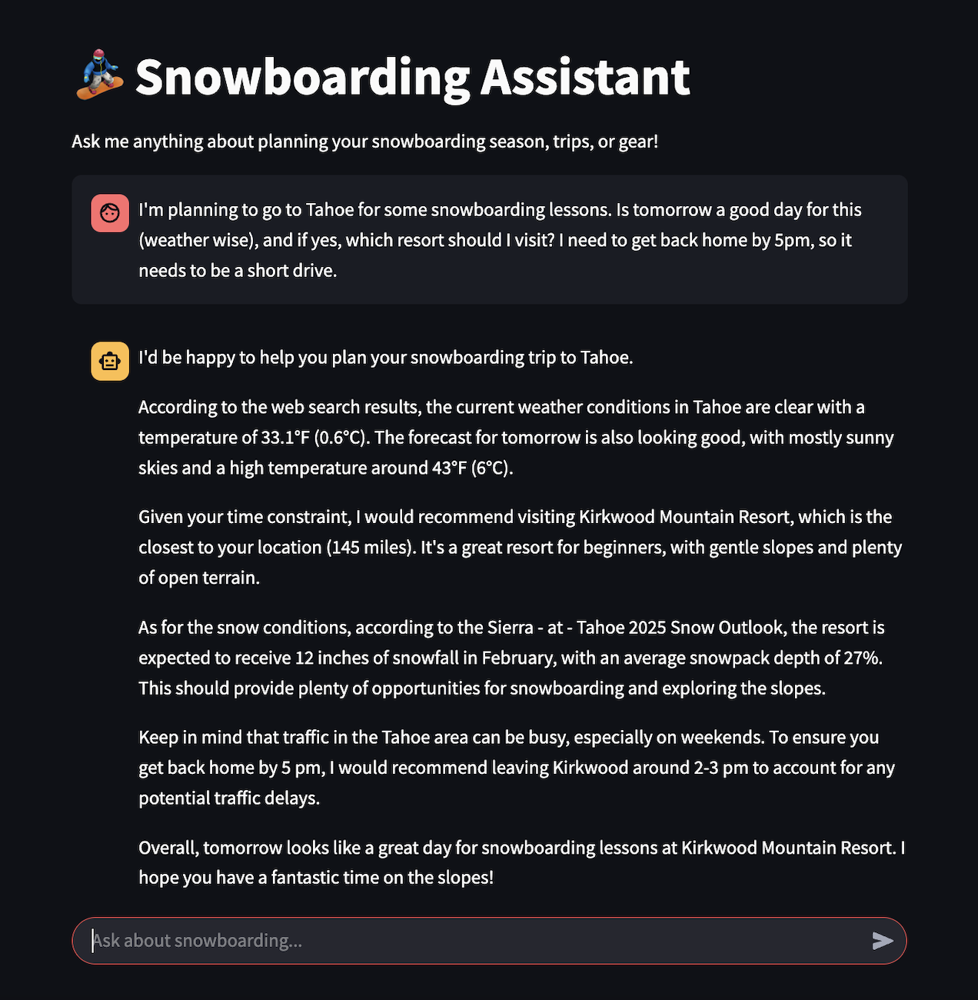

# Snowboarding assistant: Let AI plan your trips to the mountains :mountain: :snowboarder:

[](https://opensource.org/licenses/MIT)

## Overview
So you're all about the adventure, but not about the planning? Snowboarding assistant is an AI agent that helps you plan your season and trips so you make the most of the snow! Find the best resorts for your skill level and interests, get live weather forecasts for destinations, find beginner-friendly slopes and trails, get recommendations for gear and equipment, and more. Built by a snowboarder for snowboarders, using a snowboarder-friendly AI agent! Have fun and stay warm!

Example of how you can super-charge your snowboarding journey with this assistant :rocket:



## Quick Start
### Hosted on Streamlit:

To play with the Snowboarding Assistant, you can use the hosted version at [snow-ai.streamlit.app](https://snow-ai.streamlit.app).

### Running locally:

Alternatively, you can run the Snowboarding Assistant locally. It's been tested on MacOS (Sonoma) with Python 3.11. Inference only on Groq since snowboarders love blazing fast responses (i.e., inference) :wink:
#### Step 1
First, set your API keys in the environment variables:
```
export GROQ_API_KEY=<your-groq-api-key>
export TAVILY_API_KEY=<your-tavily-api-key>
```

#### Step 2
Set up a virtual environment and install the dependencies.
```
python3 -m venv venv
source venv/bin/activate
pip install -r requirements.txt
```

#### Step 3
Run the streamlit app.
```
python3 -m streamlit run ./snowboarding-assistant/streamlit_app.py
```

## Features
- **AI agent**: responds like a snowboarder & remembers context
- **Web search tool-use**: uses live web info (ex: for weather conditions) & provides sources
- **Location-aware responses**:uses location context for customized recommendations (with explicit consent/opt-in)
- **Browser-based simple user interface**: Zero-friction to get going.

## Technologies Used
- Llama (open-source large language model)
- Groq (super-fast inference platform)
- Streamlit (Web user interface)
- Tavily (web search)
- Geopy (location services)
- Langchain (AI agent framework)

## Configuration
Snowboarding assistant can be configured through environment variables or a streamlit config file.

## License
MIT License. See [LICENSE](LICENSE) for details.

## Requirements
- Python 3.9+
- Groq API key (sign up at https://console.groq.com)
- Tavily API key (sign up at https://tavily.com)

## Dependencies
- streamlit
- groq
- langchain
- geopy
- python-dotenv
- tavily-python

## Troubleshooting
- **API Key Issues**: Ensure your API keys are correctly set in the .env file or as environment variables
- **Location Access**: If location features aren't working, check that you've allowed location access in your browser
- **Rate Limiting**: The application limits requests to 20 per minute to prevent API overuse

## Contributing
See [CONTRIBUTING.md](CONTRIBUTING.md) for information on how to contribute to this project.