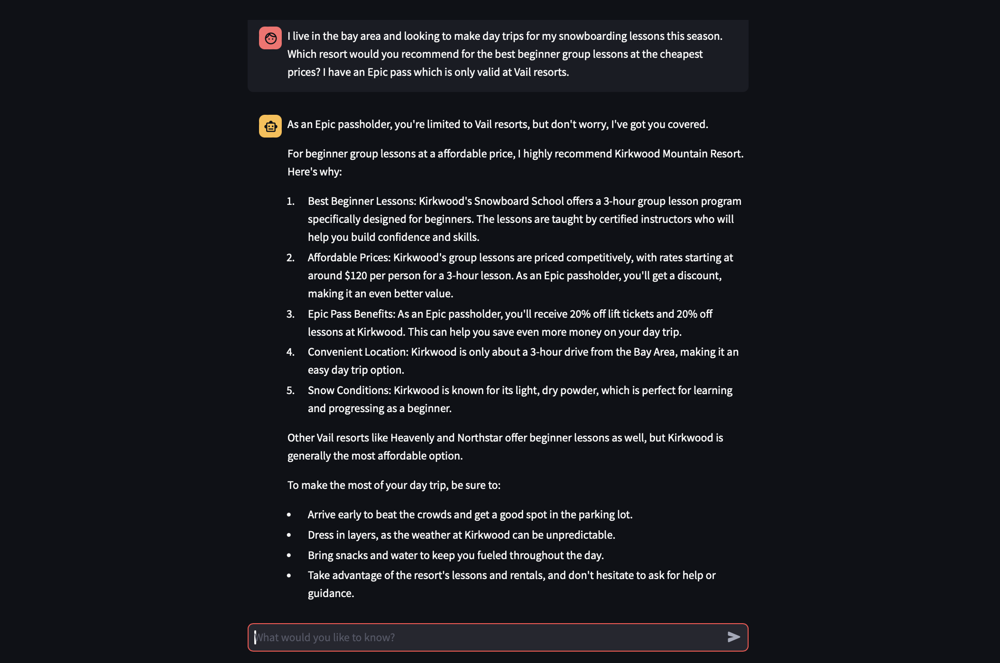

# Snowboard assistant  :mountain:  :snowboarder:  

Snowboard assistant helps you plan your season and trips so you make the most of the snow!

Here's an of how you can super-charge your snowboarding journey with it :rocket:



## Quick Start
We currently only support running the assistant locally on MacOS (Sonoma). Inference only on Groq since snowboarders love blazing fast responses (i.e., inference) :wink:
#### Step 1
First, you can set your Groq API key in the environment variables:
```
export GROQ_API_KEY=<your-groq-api-key>
```

#### Step 2
Set up a virtual environment and install the dependencies.
```
python3 -m venv venv
source venv/bin/activate
pip install -r requirements.txt
```

#### Step 3
Run the streamlit app.
```
python3 -m streamlit run ./snowboarding-assistant/streamlit_app.py
```

#### Step 4
Start planning your season with the assistant on your browser - have fun and stay warm!

## Features
- **Natural Language Input**: Describe what you want to do in plain English (or other supported languages).
- **Snowboarder-friendly responses and assistance**: The assistant is designed to be helpful and friendly to snowboarders.
- **Browser-based simple user interface**: Zero-friction to get going.

## Technologies Used
- Llama (super-open large language model)
- Groq (super-fast inference platform)
- Streamlit (Web user interface)

## Configuration
Snowboarding assistant can be configured through environment variables. Support for config file coming soon.

## License
MIT License. See [LICENSE](LICENSE) for details.